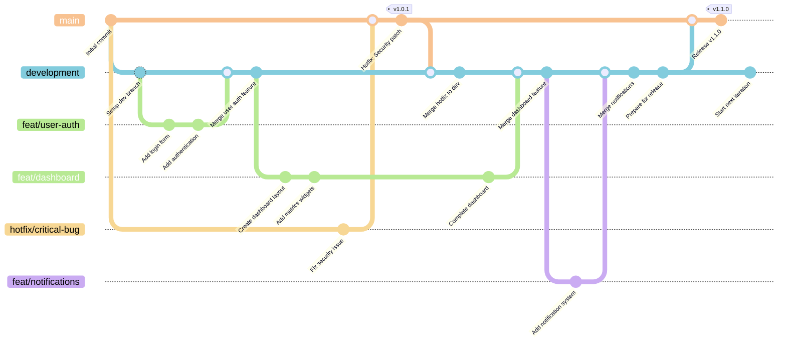

# Branching Strategy

This document outlines the Git branching strategy for Coldtivate. We mostly follow the [GitFlow](https://nvie.com/posts/a-successful-git-branching-model/) branching strategy, with some modifications to accommodate the specific needs of the Coldtivate project.

## Main Branches

The following branches are permanent and protected:

- **`main`**: Contains production-ready code. Only merges from `development` are allowed.
- **`development`**: Integration branch for ongoing development. All feature and fix branches are merged here.

## Supporting Branches

| Branch Type | Prefix     | Base Branch   | Merge Target  | Naming Convention                | Purpose |
| ----------- | ---------- | ------------- | ------------- | -------------------------------- | ------- |
| Feature     | `feat/`    | `development` | `development` | `feat/ABC-123-feature-name`      | New features and enhancements |
| HotFix      | `hotfix/`  | `main`        | `main`        | `hotfix/ABC-123-bug-description` | Critical production fixes |

**Note:** Releases are created by merging `development` into `main` and tagging the merge commit with version numbers (e.g., `v1.2.3`).

## Git Flow Visualization

The following diagram illustrates the branching strategy and typical development workflow:



**Diagram Legend:**

- **🟠 Main Branch**: Production-ready code with version tags (#f8c291)
- **🔵 Development Branch**: Integration branch for ongoing work (#82ccdd)
- **🟢 Feature Branches** (feat/*): New functionality development (#b8e994)
- **🟡 Hotfix Branches** (hotfix/*): Critical production fixes (#f7d794)

*Colors match the project's established Mermaid diagram theme used throughout the documentation.*

## Workflow

### Creating a New Feature Branch

For **new features and enhancements**:

1. **Start from development branch:**
   ```sh
   git checkout development
   git pull origin development
   ```

2. **Create and switch to your feature branch:**
   ```sh
   git checkout -b feat/ABC-123-feature-name
   ```

   **Naming Convention Examples:**
   - `feat/user-authentication`
   - `feat/dashboard-redesign`
   - `feat/JIRA-456-payment-integration`

3. **Develop your feature:**
   - Make focused commits with clear messages
   - Regularly sync with development to avoid conflicts:
     ```sh
     git fetch origin
     git rebase origin/development
     ```

4. **Push your branch:**
   ```sh
   git push origin feat/ABC-123-feature-name
   ```

### Creating a Hotfix Branch

For **critical production fixes only**:

1. **Start from main branch:**
   ```sh
   git checkout main
   git pull origin main
   ```

2. **Create and switch to your hotfix branch:**
   ```sh
   git checkout -b hotfix/ABC-123-bug-description
   ```

   **Naming Convention Examples:**
   - `hotfix/security-vulnerability`
   - `hotfix/BUG-789-payment-failure`
   - `hotfix/critical-login-issue`

3. **Fix the issue:**
   - Keep changes minimal and focused
   - Test thoroughly before pushing

4. **Push your branch:**
   ```sh
   git push origin hotfix/ABC-123-bug-description
   ```

### Merging Changes

#### Feature Branch Merging
1. **Create a Pull Request (PR)** to merge your feature branch into `development`
2. **Request code review** from team members
3. **Address review feedback** and update your branch as needed
4. **Merge after approval** - use "Squash and merge" for clean history
5. **Delete the feature branch** to keep the repository clean

#### Hotfix Branch Merging
1. **Create a PR** to merge your hotfix branch into `main`
2. **Get urgent review** for critical fixes
3. **Merge after approval** - typically fast-tracked for critical issues
4. **Immediately merge main into development** to keep branches in sync:
   ```sh
   git checkout development
   git pull origin development
   git merge main
   git push origin development
   ```
5. **Delete the hotfix branch**

### Release Tagging

#### Creating a Release
1. **Ensure development is stable:**
   ```sh
   git checkout development
   git pull origin development
   # Run tests and verify stability
   ```

2. **Merge to main:**
   ```sh
   git checkout main
   git pull origin main
   git merge development
   git push origin main
   ```

3. **Create and push release tag:**
   ```sh
   # For semantic versioning (recommended for Node-based projects)
   yarn version --new-version (major | minor | patch)
   git push --tags

   # Or manually:
   git tag -a v1.2.3 -m "Release version 1.2.3"
   git push origin v1.2.3
   ```

#### Semantic Versioning Guidelines
- **Major (X.0.0)**: Breaking changes, API modifications
- **Minor (1.X.0)**: New features, backward-compatible changes
- **Patch (1.2.X)**: Bug fixes, hotfixes, small improvements

**Example Tags:** `v1.0.0`, `v1.1.0`, `v1.1.1`

## Best Practices

### Branch Management
- **Keep branch names descriptive and concise** following the naming conventions
- **Create focused branches** - one feature or fix per branch
- **Delete merged branches** to keep the repository clean
- **Regularly sync with base branch** to avoid merge conflicts

### Commit Guidelines
- **Write meaningful commit messages** that explain what and why
- **Make atomic commits** - each commit should be a logical unit
- **Use present tense** in commit messages (e.g., "Add user authentication")
- **Include ticket numbers** when applicable (e.g., "Fix login bug - closes #123")

### Code Review Process
- **Always create a PR** for merging into protected branches (`main`, `development`)
- **Request appropriate reviewers** based on the changes
- **Address feedback promptly** and engage in constructive discussions
- **Test your changes** before requesting review

### Branch Protection
- **Never push directly** to `main` or `development` branches
- **All changes must go through PR review** for protected branches
- **Hotfixes require immediate attention** but still need review approval

### Conflict Resolution
- **Resolve conflicts locally** before pushing
- **Use rebase instead of merge** for feature branch updates
- **Communicate with team** if conflicts are complex

By following this strategy, we maintain a clean, organized, and efficient Git workflow that scales with team growth and ensures code quality.
