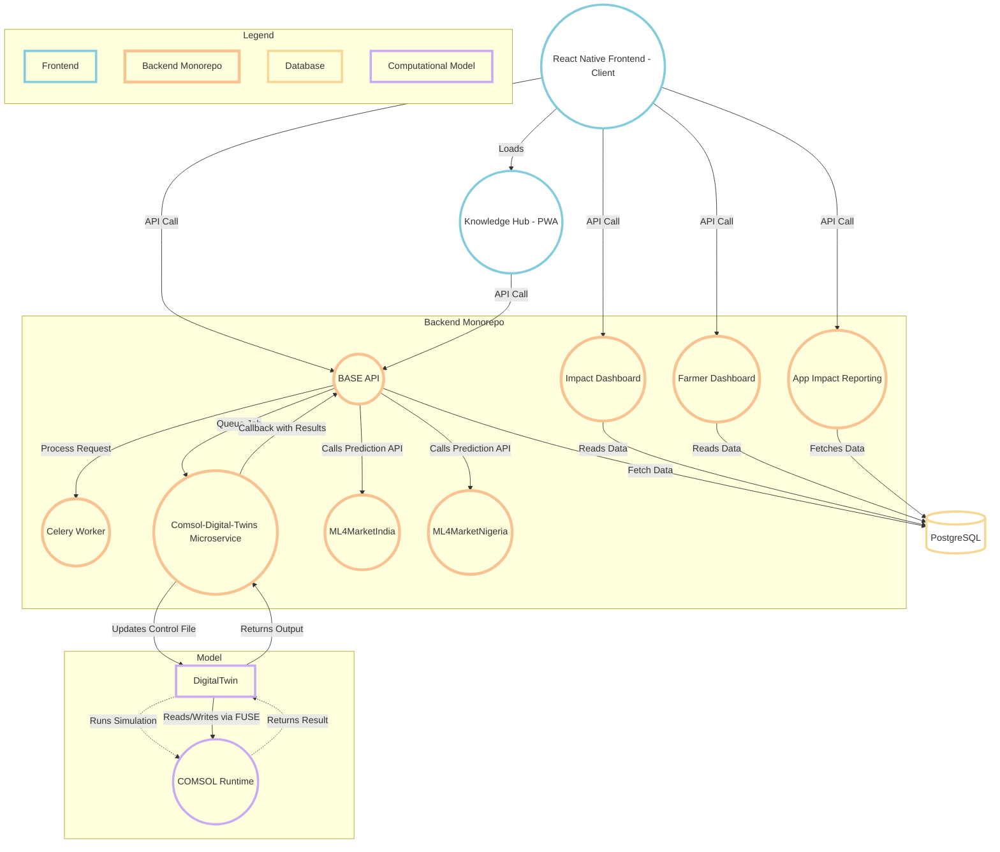

---
hide:
  - toc
---

# Architecture Overview
This documentation provides an overview of the system architecture for the Coldtivate platform, detailing its database schema, functional features, technical capabilities, and integrations.

---

## High-Level Architecture

### 1. [Database Schema](/core-concepts/database/)
Coldtivate's PostgreSQL database is structured to efficiently manage cold storage operations while ensuring data integrity. The schema uses interconnected tables to handle user authentication, storage tracking, and marketplace transactions across the platform.

---

### 2. [Functional Features](/core-concepts/functional-features/integrations-data-collection/)
#### Data Collection
- Real-time temperature monitoring via sensor integration
- API endpoints expose sensor data to frontend and backend

#### External Services
- Price predictions, impact assessment, and reporting
- Market data via scraping services

---

### 3. Technical Features
#### [Deep Linking](/core-concepts/technical-features/deep-linking/)
- React Native implementation for direct navigation from external links

#### [Stale-While-Revalidate (SWR)](/core-concepts/technical-features/swr/)
- Cache-first data fetching with background updates

#### [Role-Based Access Control (RBAC)](/core-concepts/technical-features/rbac/)
- User permissions enforced in UI and API layers

#### [Internationalization (i18n)](/core-concepts/technical-features/internationalization/)
- Multi-language support via locale-based translations

#### [Mobile Geolocation](/core-concepts/technical-features/geolocation)
- Location-based functionalities, including map rendering, geocoding, and reverse geocoding

---

### 4. Backend & Infrastructure
#### [BASE API (Django)](/core-concepts/repositories/backend/)
- Manages authentication, storage, and sensor data
- Uses **Celery** for background tasks and **Valkey** for caching

#### [Task Queue (Celery)](/core-concepts/scheduled-jobs/)
- Processes scheduled tasks and notifications
- Persists tasks in **PostgreSQL**

#### [Digital Twin Computation (Computational Model)](/core-concepts/functional-features/integrations-data-collection/#2-simulation-integration-comsol-digital-twin)
- Predicts shelf-life from temperature data
- Executes via external **COMSOL** runtime

---

## Architecture Diagram
Below is a diagram representation of the system's architecture:

#### Diagram Description

This diagram illustrates the architecture of the system, focusing on data flow and interactions between core components. The system is organized into five main layers:

**1. Frontend (Client-Facing Components):**

* **React Native Frontend - Client:** This is the primary mobile application, built using React Native. It interacts with the backend through API calls.
* **Knowledge Hub - PWA:** A Progressive Web App accessed via browsers and embedded WebViews. It serves as an auxiliary frontend interface and communicates with the backend through the same API.

**2. Backend Monorepo:**

* **BASE API:** The central backend entry point. It handles all client requests, orchestrates data processing, and interacts with other backend services.
* **Impact Dashboard:** A backend service responsible for generating and managing impact-related data.
* **Farmer Dashboard:** A backend service that provides data and functionality for farmer-specific information.
* **App Impact Reporting (VCCAAirService):** A service that handles application impact reporting.
* **Celery Worker:** A task queue system used for asynchronous processing of tasks.
* **ML4MarketIndia & ML4MarketNigeria:** Internal services that provide machine learning-driven price and demand forecasts.
* **Comsol-Digital-Twins Microservice:** A dedicated microservice responsible for managing simulation jobs using COMSOL. Jobs are queued via a Celery task triggered by the Base API. This microservice watches a control file through a FUSE mount. When a job starts, the control file is updated to trigger the COMSOL Runtime. Upon completion, the simulation results are returned to this service, which then sends a callback with the output to the Base API for further processing and storage.

**3. Database:**

* **PostgreSQL:** The system’s primary relational database, responsible for persisting application and analytics data.

**4. Computational Model:**

* **Digital Twin Computation - Models:** This component represents the computational models used for simulations.
* **COMSOL Runtime:** A simulation engine that runs the computational models.

**Data Flow and Interactions:**

* The `React Native frontend` makes API calls to the `BASE API`, `Impact Dashboard`, and `Farmer Dashboard`.
* The `BASE API` retrieves and stores data in the `PostgreSQL database`.
* Background jobs and async processes are delegated to `Celery`.
* The `BASE API` retrieves price prediction data from `ML4MarketIndia` and `ML4MarketNigeria`, and makes this data available to the `React Native frontend` through dedicated API endpoints.
* For simulation logic, the `BASE API` triggers the `Digital Twin`, which runs computational models using `COMSOL` and saves the results back to the `database`.
* The `Comsol-Digital-Twins microservice` waits for simulation jobs and, when one becomes available, updates a FUSE-mounted control file to trigger `COMSOL` simulations. It also reads simulation outputs and sends a callback with results to the `Base API`.
* Other backend services like the `Impact Dashboard`, `Farmer Dashboard`, and `VCCAAirService` consume data directly from `PostgreSQL`.

