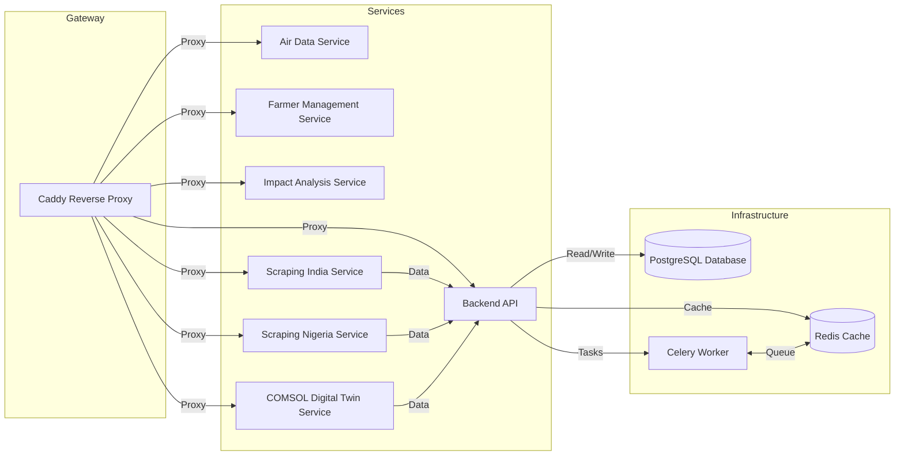

# Project Architecture - Docker Containers

## Overview

This document provides an overview of the Docker containers used in this project, describing their roles and interactions within the system architecture. The project uses multiple services, each running in a separate container, with Caddy acting as the gateway and reverse proxy.

## Architecture Diagram

## Containers

### 1. Caddy (Gateway & Reverse Proxy)

**Role:**

* Serves as the main entry point for all external requests.
* Manages HTTPS certificates using ACME (Let's Encrypt).
* Handles reverse proxying to internal services.
* Implements CORS policies.

**Key Features:**

* Automatic HTTPS management.
* Reverse proxy to backend services.
* CORS handling to allow cross-origin requests.

**Dependencies:**

* Requires correct DNS configuration for certificate issuance.

**Ports:**

* `80:80`
* `443:443`

### 2. Database (PostgreSQL + PostGIS)

**Role:**

* Stores all persistent application data.
* Provides geospatial data support via PostGIS.

**Image:**

* `postgis/postgis:12-3.3-alpine`

**Dependencies:**

* Used by Backend API, Scraping services, and Celery workers.

**Ports:**

* `54321:5432`

### 3. Redis Cache (Valkey)

**Role:**

* Provides caching functionality for faster data retrieval.
* Supports Celery task queuing.

**Image:**

* `valkey/valkey:7-alpine`

**Dependencies:**

* Used by Backend API and Celery workers.

### 4. Backend API (Application Core Service)

**Role:**

* Handles business logic and core application functionality.
* Exposes RESTful API endpoints.
* Communicates with a database for data persistence.

**Dependencies:**

* Requires PostgreSQL for data storage.
* Uses Redis for caching and Celery for background tasks.

**Base Image:**

* Uses `python:3.9-slim` with additional dependencies such as GDAL.

**Ports:**

* `8000:8000`

### 5. Celery Worker

**Role:**

* Executes asynchronous background tasks.
* Handles scheduled tasks using Django scheduler.

**Dependencies:**

* Requires API for task fetching.
* Uses Redis for queue management.

### 6. Air Data Service (AirAPI)

**Role:**

* Processes air quality data.
* Exposes relevant endpoints for retrieving air quality metrics.

**Dependencies:**

* Requires API for data persistence.

**Ports:**

* `8002:5000`

### 7. Farmer Management Service (FarmerAPI)

**Role:**

* Manages farmer-related data and interactions.
* Handles authentication and authorization.

**Dependencies:**

* Requires API for data access.

**Ports:**

* `8003:80`

### 8. Impact Analysis Service (ImpactAPI)

**Role:**

* Analyzes environmental and agricultural impact data.
* Provides reporting and insights based on collected data.

**Dependencies:**

* Requires API for data access.

**Ports:**

* `8001:80`

### 9. Impact Dashboard Scheduler

**Role:**

* Handles scheduled tasks related to impact analysis.

**Dependencies:**

* Requires API for data access.

**Ports:**

* `5001:80`

### 10. Farmer Scheduler

**Role:**

* Manages scheduled tasks related to farmer data processing.

**Dependencies:**

* Requires API for data access.

**Ports:**

* `5002:3000`

### 11. Scraping Services

#### Scraping India

**Role:**

* Scrapes agricultural data from Indian sources.
* Stores scraped data in a dedicated volume.

**Dependencies:**

* Requires API for data storage.

**Ports:**

* `5101:5000`

#### Scraping Nigeria

**Role:**

* Scrapes agricultural data from Nigerian sources.
* Stores scraped data in a dedicated volume.

**Dependencies:**

* Requires API for data storage.

**Ports:**

* `5102:5000`

### 12. COMSOL Digital Twin Service (comsol-dt)

**Role:**

- Runs predictive simulations for shelf life and quality using COMSOL models.
- Uses a FUSE-mounted control file to communicate with the COMSOL Runtime.

**Dependencies:**

- Requires Celery for job scheduling.
- Communicates indirectly with PostgreSQL via a Base API callback.
- Mounted FUSE filesystem must be accessible for COMSOL to react to control signals.

**Base Image:**

- `python:3.9-slim`
- COMSOL Runtime, GDAL, FUSE, and simulation scripts.

**Ports:**

- `5900:5900`

## Deployment

The services are containerized using Docker and orchestrated using Docker Compose. The `docker-compose.yml` file defines service configurations, networking, and dependencies.

## Summary

* Caddy acts as the gateway, managing requests, security, and CORS policies.
* Each service is deployed in a separate container with well-defined responsibilities.
* Backend API and COMSOL services use a Debian-based Python image with additional dependencies.
* PostgreSQL with PostGIS is used for geospatial data.
* Redis (Valkey) handles caching and Celery task management.
* Services interact in a modular and scalable architecture, with dependencies clearly defined.

This documentation provides a foundational understanding of the project's containerized infrastructure, facilitating easier maintenance and future expansion.
