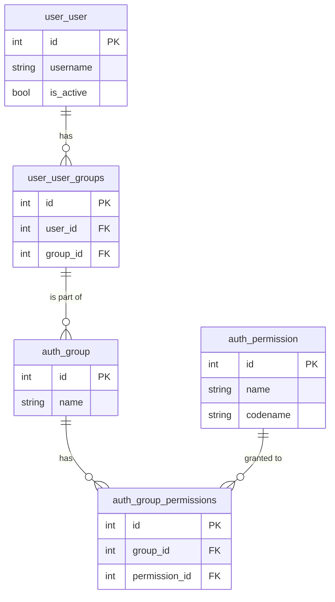
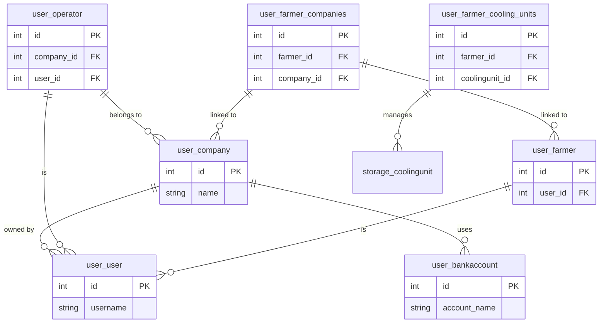
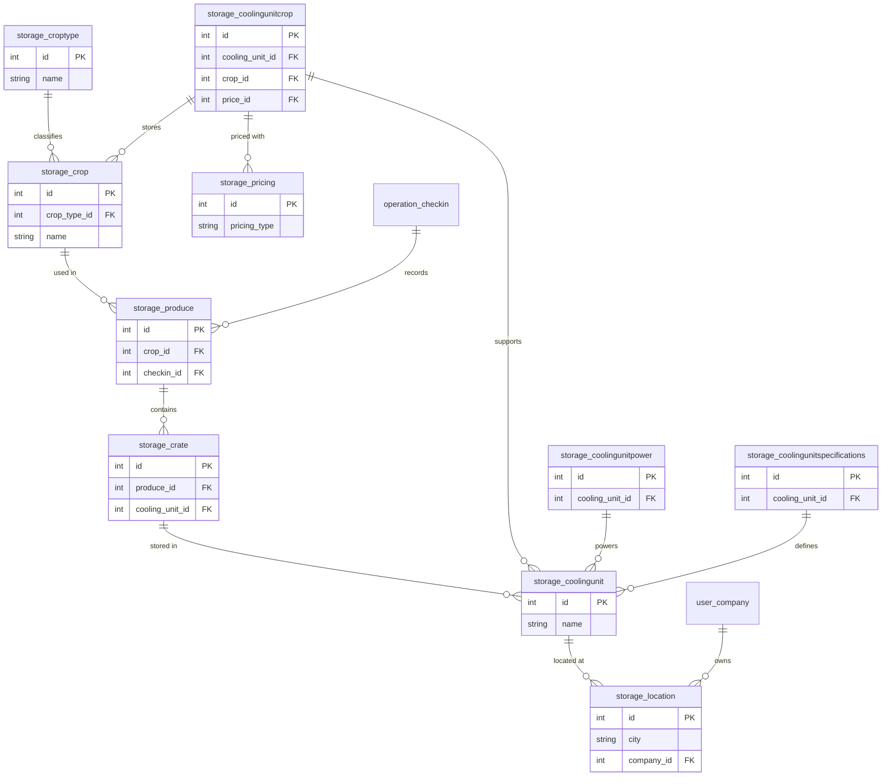
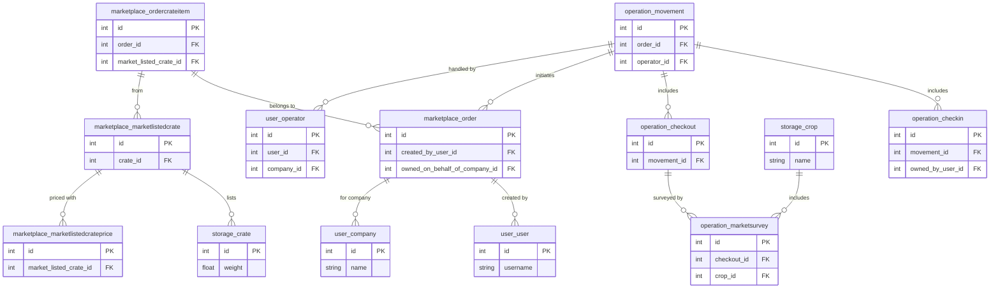
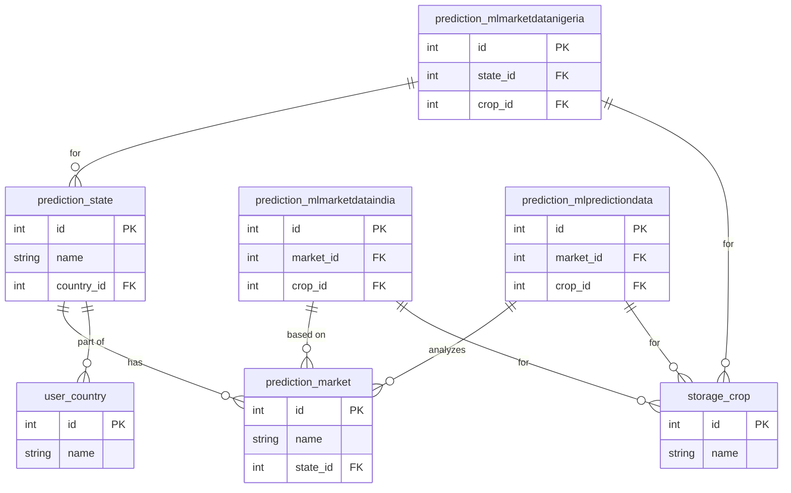
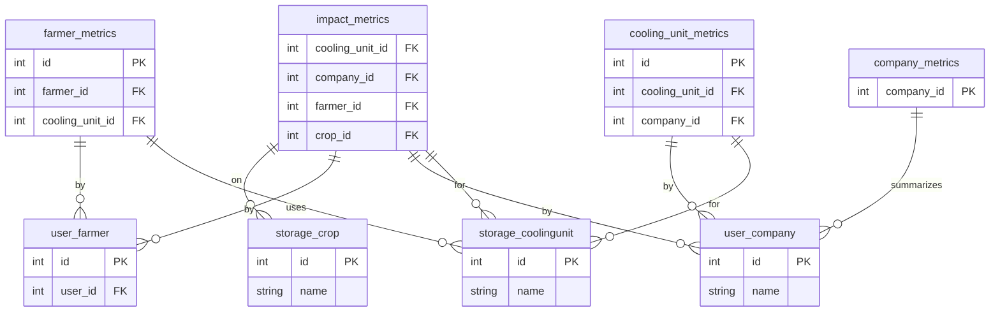

# Database Entities
This section provides a high-level overview of the key Coldtivate database entities. It summarizes the primary tables, their purposes, and relationships.

---

## Database Relationships Overview

The project's database consists of multiple interconnected tables categorized mainly into **user management, storage, operations, marketplace, predictions, and metrics**. Below is a **brief overview of the key relationships** between them:

### 1. User & Company Relationships
- **`user_user`** (Users) is the central table that links to:
    - **`user_company`** (Companies) through **`user_operator`** and **`user_serviceprovider`**.
    - **`user_farmer`** (Farmers) through **`user_farmer_companies`** (Farmer-Company Link).
    - **`user_notification`**, **`user_genericusercode`**, **`user_invitationuser`**, and **`user_user_groups`** (User Roles & Notifications).
    - **`user_bankaccount`** (Company Bank Details).
    - **`auth_group_permissions`** (Permissions for different user roles).

### 2. Storage & Cooling Units
- **`storage_coolingunit`** (Cooling Units) links to:
    - **`storage_location`** (Geographical location).
    - **`storage_crate`** (Storage crates within a unit).
    - **`storage_produce`** (Produce stored in the unit).
    - **`storage_coolingunitcrop`** (Tracks which crops can be stored in which units).
    - **`storage_coolingunitpower`** (Power consumption details).
    - **`user_farmer_cooling_units`** (Farmers using cooling units).
    - **`storage_coolingunit_operators`** (Operators managing the unit).

### 3. Storage & Produce
- **`storage_crate`** (Individual crates in cooling units) links to:
    - **`storage_produce`** (A set of crates of the same crop type, checked in at the same time).
    - **`storage_coolingunit`** (The cooling unit where the crate is stored).
    - **`storage_cratepartialcheckout`** (Represents partial checkouts (e.g., partial sales) of this crate).

### 4. Marketplace & Orders
- **`marketplace_order`** (Orders) links to:
    - **`marketplace_marketlistedcrate`** (Available crates for sale).
    - **`marketplace_ordercrateitem`** (Items ordered).
    - **`marketplace_orderpickupdetails`** (Pickup logistics).
    - **`marketplace_coupon`** (Discounts applied to orders).
    - **`marketplace_paystackaccount`** (Payment details).

### 5. Operations & Transactions
- **`operation_checkin`** (Incoming produce) and **`operation_checkout`** (Outgoing produce) both link to:
    - **`operation_movement`** (Tracking movements in and out).
    - **`storage_produce`** (Produce being checked in/out).
    - **`marketplace_order`** (When an order triggers movement).
    - **`operation_marketsurvey`** (Survey of market price/loss post-checkout).
    - **`operation_marketsurveypreprocessing`** (Processing market survey before completion).

### 6. Prediction & Analytics
- **`prediction_market`** stores **market insights** and links to:
    - **`prediction_mlmarketdataindia`**, **`prediction_mlmarketdatanigeria`** (Market price historical data).
    - **`prediction_mlpredictiondata`** and **`prediction_mlpredictiondatang`** (Price forecasting).
    - **`storage_crop`** (The type of crops in the market predictions).

### 7. Metrics & Performance Tracking
- **`company_metrics`**, **`cooling_unit_metrics`**, **`impact_metrics`** and **`farmer_metrics`** track usage statistics related to:
    - Companies, cooling units, farmers, and crates in storage.
    - Energy consumption and occupancy levels in cooling units.
    - Revenue and operational performance over time.

---

## Database Schemas

To improve readability, we have divided the database schema into multiple smaller diagrams, each focusing on a specific aspect of the system. Instead of a single large and complex diagram, this modular approach allows us to better understand relationships between tables without overwhelming detail.

The database schema is organized into the following sections:

1. **User & Authentication** – Covers user accounts, authentication, permissions, and user groups.
2. **User, Company & Operators** – Represents companies, farmers, and operator relationships.
3. **Storage & Cooling Units** – Focuses on storage units, crops, crates, and cooling unit specifications.
4. **Operations & Marketplace** – Includes logistics, orders, transactions, and market listings.
5. **Predictions & Analytics** – Contains market prediction models and their dependencies.
6. **Metrics & Performace Tracking** – Contains usage and revenue statistics that are relevant for company owners.

### Why This Organization?
- **Logical Grouping**: Related tables are grouped based on their purpose in the system.
- **Improved Readability**: Each diagram is smaller and easier to interpret.
- **Clearer Relationships**: Helps identify how different entities interact across functional domains.

### 1. User & Authentication Tables

### 2. User, Company & Operators Tables

### 3. Storage & Cooling Units

### 4. Operations & Marketplace

### 5. Prediction & Analytics

### 6. Metrics & Performace Tracking

---

For a more comprhensive overview of each table, please refer to the [Schema Breakdown](database-entities.md) section
