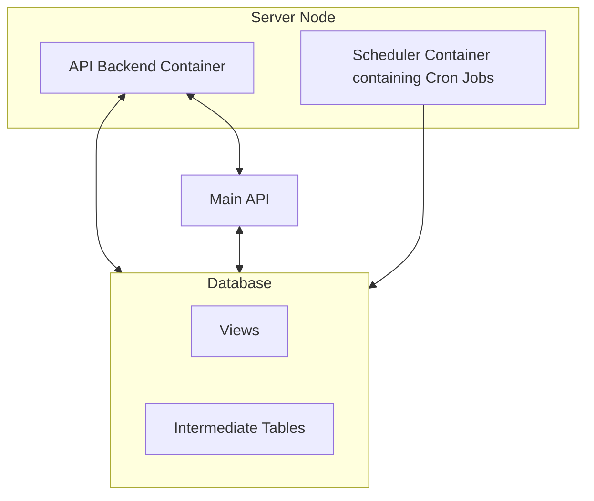

# Farmers Dashboard

## Functionalities Overview and API Points

The Farmer Dashboard Backend is a Django-based API microservice in the Coldtivate infrastructure that has 2 main functionalities: serving the main backend for **on-request data** and managing **scheduled tasks** in order to aggregate data on regular time basis. 

First, the service is responsible for aggregating, processing, and exposing metrics relevant to cold storage operations, environmental impact (CO2), revenue, and food loss. This data is displayed in the 'Analytics' tab of the Coldtivate app, when accessed as a Cooling User or Consumer. The API serves precomputed metrics stored in PostgreSQL tables and exposes them through structured endpoints.

This project also contains a python file (`indicator_reporter.py`) which is executed through cron jobs in order to fill in some statistical data on certain time periods. The cron jobs are triggered inside of a separate docker container. This handles the routine tasks that aggregate the data and update the appropriate tables. 

### Key Features
- Automated data collection and processing
- Daily metrics updates via cronjobs
- RESTful API endpoints for data access
- Docker containerization for easy deployment
- PostgreSQL database integration


### Endpoints

#### 1. Farmer Base Slice
- **Endpoint**: `/farmer-base-slice/`
- **Method**: POST
- **Description**: Retrieves basic farmer information
- **Request Body**:
```json
{
    "farmer_id": "string"
}
```
- **Response**: JSON object containing farmer details

#### 2. Farmer Slice
- **Endpoint**: `/farmer-slice/`
- **Method**: POST
- **Description**: Retrieves detailed farmer metrics
- **Request Body**:
```json
{
    "farmer_id": "string",
    "unit_ids": "string",
    "start_date": "YYYY-MM-DD",
    "end_date": "YYYY-MM-DD"
}
```
- **Response**: JSON object containing farmer metrics

#### 3. Impact Slice
- **Endpoint**: `/impact-slice/`
- **Method**: POST
- **Description**: Retrieves impact metrics
- **Request Body**:
```json
{
    "farmer_id_2": "string",
    "cooling_unit_id": "string",
    "start_date": "YYYY-MM-DD",
    "end_date": "YYYY-MM-DD"
}
```
- **Response**: JSON object containing impact metrics

## Cloning Git Repository

To begin development, clone the repository (this is the setup if you have connected Github with SSH keys, otherwise you will have to use an alternative git clone argument):

```bash
git clone https://gitlab.com/b1866/coldtivate/backend-monorepo.git
cd backend-monorepo/Farmers-Dashboard-Backend
```

Ensure you have the correct branch checked out:

```bash
git status
git checkout main
```
## Recommended IDE Configuration

- **PyCharm Professional** (supports Django)
- **VSCode** (requires Django and Python extensions)

## Database Setup

Please refer to the [Database section](https://docs.coldtivate.org/core-concepts/database/) for an overview of the tables, and read through the documentation below to ensure all the required tables and views exist.

**This project is dependable on tables and views to exist in the Database.**

### Intermediate tables
The “intermediate” tables were created specifically for the backend of the Impact and Farmers dashboards. They store precomputed metrics, which are then served to the front-end of the Coldtivate app via the API endpoints. There are 2 intermediate tables that are used by the service, and each of them stores metrics for different screens of the Farmers Dashboard.
These tables are:

- **farmer_metrics** - This table stores a single row of data for each company in the database. This table is updated daily by the `indicator_reporter.py` python script, which is triggered in the `daily-at-midnight.sh` cron job script. 

- **impact_metrics** - The impact_metrics stores all impact-related metrics such as the farmer revenue evolution and food loss evolution. The table is created by the Impact Dashboard Backend. Please refer to [this page](https://docs.coldtivate.org/core-concepts/repositories/backend/impact-dashboard/) for more information.

## Database Schema and Required Views

The `farmer_metrics` table is dependable on the `analytics_crate_movements` view, which is created by the Impact Dashboard Backend service. Please refer to the [Impact Dashboard](https://docs.coldtivate.org/core-concepts/repositories/backend/impact-dashboard/) page for more information on how to create the `impact_metrics` table and its dependency on DB views. Furthermore, please note that you need to run `create_tables.sql` in order to create the `farmer_metrics` table, if not created already. 

### Farmer Metrics Table
The `farmer_metrics` table stores daily metrics for individual cooling users:

| Column Name             | Type     | Description |
|-------------------------|----------|-------------|
| `date`                  | `DATE`   | The actual day the metrics represent (i.e. data collected on this date). |
| `report_date`           | `DATE`   | The date when this metric record was generated and inserted into the database. |
| `farmer_id`             | `INTEGER`| Unique identifier of the farmer associated with the metrics. |
| `cooling_unit_id`       | `INTEGER`| Identifier of the cooling unit used by the farmer. |
| `gender`                | `VARCHAR`| Gender of the farmer (`Male`, `Female`, or `Other`). |
| `room_crates_in`        | `INTEGER`| Total number of crates checked **into** the coldroom on the given day. |
| `room_ops_in`           | `INTEGER`| Total number of distinct **check-in operations** performed (i.e. how many times produce was stored). |
| `room_kg_in`            | `INTEGER`| Total **weight (in kilograms)** of produce checked into the coldroom. |
| `room_crates_out`       | `INTEGER`| Total number of crates **removed** from the coldroom on the given day. |
| `room_ops_out`          | `INTEGER`| Total number of distinct **check-out operations** (i.e. how many times produce was removed). |
| `room_kg_out`           | `INTEGER`| Total **weight (in kilograms)** of produce removed from the coldroom. |
| `check_in_crates_crop`  | `JSONB`  | JSON object mapping crop types to the **number of crates** checked in for each crop on that day. |
| `check_in_kg_crop`      | `JSONB`  | JSON object mapping crop types to the **total weight (kg)** checked in for each crop.  |
| `check_out_kg_crop`     | `JSONB`  | JSON object mapping crop types to the **total weight (kg)** checked out for each crop. |
| `check_out_crates_crop` | `JSONB`  | JSON object mapping crop types to the **number of crates** removed (checked out) per crop. |


## Local Deployment 

### Configure database connection

First, you need to configure the project environmental variables. 

**Option A: Create .env file (recommended)**

Create a `.env` file in the Farmers-Dashboard-Backend directory with your database credentials:
```bash
  DB_NAME=impact_db
  DB_USERNAME=user
  DB_PASSWORD=pass
  DB_HOST=localhost
  DB_PORT=5432
```

**Option B: Edit default values in code**

Alternatively, you can hardcode default values by updating the database configuration in these files:

  - `main.py`
  - `DataSlicer.py`
  - `utils.py`

Search for "DB_HOST" or "DB_USERNAME" in your IDE to find all locations.

**Note for contributors**: The current architecture has database configuration duplicated across multiple files, and each file independently calls `load_dotenv()`. This works but is inefficient and makes configuration management confusing. This would be a great area for code improvement—centralizing configuration into a single config module would make the codebase more maintainable. If you're interested in contributing, this refactoring would be very welcome!

### Local Deployment in Docker

To run the API within Docker (make sure you have Docker installed and running):

#### 1. Start the service:

```bash
docker compose up --build
```
#### 2. Access the API at:

```
http://localhost:8000
```

### Alternative Local Setup

#### 1. Setup the URL resolving to be using the localhost

```bash
echo "127.0.0.1 api.coldtivate.localhost air.coldtivate.localhost farmer.coldtivate.localhost impact.coldtivate.localhost" | sudo tee /etc/hosts
cat /etc/hosts # confirm it was added.
```

#### 2. Install Python Dependencies

Create a virtual environment and install dependencies:

```bash
python3 -m venv venv
source venv/bin/activate
pip install -r requirements.txt
```
#### 3. Run the project
```bash
python3 main.py runserver
```

## Project Structure - Directories and Files

```
Farmers-Dashboard-Backend/
├── cron/                   # Cron job scripts for scheduled metrics update
├── fastAPI/                # FastAPI HTML frontend served by the backend
├── logos/                  # Application and Docker branding logos
├── sql_queries/            # SQL query files used for computing farmer metrics
├── views/                  # SQL views, including analytics_crate_movements
├── DataSlicer.py           # Core logic to slice DB data for API endpoints
├── Dockerfile              # Dockerfile for the FastAPI web API container
├── Dockerfile.scheduler    # Dockerfile for the scheduler/metrics container
├── INTEGRATION-GUIDE.md    # Deployment and service integration instructions
├── README.md               # Project overview and basic setup instructions
├── create_tables.sql       # SQL script to initialize necessary DB tables
├── docker-compose.yaml     # Docker Compose configuration for all containers
├── entry_point.sh          # Entrypoint shell script for Docker container
├── indicator_reporter.py   # Scheduler script to update farmer_metrics table
├── main.py                 # FastAPI app entry point (defines all API endpoints)
├── requirements.txt        # Python dependencies for the project
├── run_scheduler.sh        # Script to start the metrics scheduler
├── supervisord.conf        # Supervisord config to manage the scheduler
└── utils.py                # Helper functions for DB connections and queries
```


## Graphical Representation of Deployed Architecture



## Schedulers, Cron Jobs and ENV Variables

The cron jobs are deployed inside of docker containers.
In order to check the list of containers you will have to run
```bash
docker ps
```
After you have identified the name of the container you can start a session in it by ssh-ing in the container by running an interactive terminal:
```bash
docker exec -it coldtivate-staging-farmers_dashboard_scheduler-1 /bin/bash
```

The cron jobs definitions can be found at the location inside of the docker container at the location:
```bash
/etc/cron.d/
```
The cron jobs are highly dependent to the environment variables being passed through in the deployment process.
Scheduled tasks update intermediate tables daily at 12:10 AM.