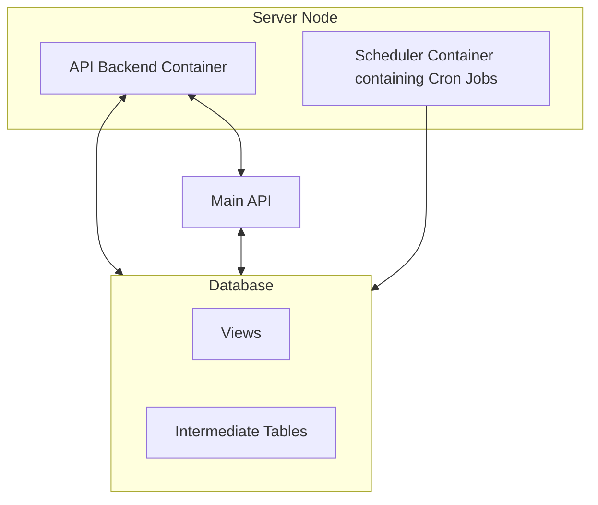

# Impact Dashboard

## Functionalities Overview and API Points

The Impact Dashboard Backend is a Django-based API microservice in the Coldtivate infrastructure that has 2 main functionalities: serving the main backend for **on-request data** and managing **scheduled tasks** in order to aggregate data on regular time basis.

First, the service is responsible for aggregating, processing, and exposing metrics relevant to cold storage operations, environmental impact (CO2), revenue, and food loss. This data is displayed in the 'Analytics' tab of the Coldtivate app, when accessed as a Registered Employee or Operator. The API serves precomputed metrics stored in PostgreSQL tables and exposes them through structured endpoints.

This project also contains a python file (`indicator_reporter.py`) which is executed through cron jobs in order to fill in some statistical data on certain time periods. The cron jobs are triggered inside of a separate docker container. This handles the routine tasks that aggregate the data and update the appropriate tables. 

### API Endpoints

| Endpoint | Method | Description                                                                    |
|-----|--------|--------------------------------------------------------------------------------|
| `/` | `GET` | Simple UI that makes it easier to interact with the API points below           |
| `/api/company-slice` | `GET` | Returns storage, revenue, and metadata for a given company                     |
| `/api/coolingunit-slice` | `GET` | Returns utilization statistics for a date range and list of cooling units      |
| `/api/impact-slice` | `GET` | Returns impact metrics for a date range and list of cooling units or a company |

## Cloning Git Repository

To begin development, clone the repository (this is the setup if you have connected Github with SSH keys, otherwise you will have to use an alternative git clone argument):

```bash
git clone https://gitlab.com/b1866/coldtivate/backend-monorepo.git
cd backend-monorepo/Impact-Dashboard-Backend
```

Ensure you have the correct branch checked out:

```bash
git status
git checkout main
```
## Recommended IDE Configuration

- **PyCharm Professional** (supports Django)
- **VSCode** (requires Django and Python extensions)

## Database Setup

Please refer to the [Database section](https://docs.coldtivate.org/core-concepts/database/) for an overview of the tables, and read through the documentation below to ensure all the required tables and views exist.

**This project is dependable on tables and views to exist in the Database.** 

### Intermediate tables
The “intermediate” tables were created specifically for the backend of the Impact and Farmers dashboards. They store precomputed metrics (computed by `indicator_reporter.py`) which are then served to the front-end of the Coldtivate app via the API endpoints. There are 3 intermediate tables and each one of them stores metrics for different screens of the Impact Dashboard.
These tables are:

- **company_metrics** - This table stores a single row of data for each company in the database. This table is updated daily by the `indicator_reporter.py --view company` python script, which is triggered in the `daily-at-midnight.sh` cron job script. 


- **cooling_unit_metrics** - This intermediate table stores the daily utilization indicators for cooling units in the Coldtivate DB as a time series. The metrics can be sliced along the cooling units and time dimensions to serve the aggregated results to the front-end. This table serves the Aggregated and Comparison screens of the dashboard enabling the functionality of the cooling unit and calendar selectors on the front-end. The table also serves the ‘Impact’ section of the Company screen specifically for the CO2 metrics. The table is updated daily by the `indicator_reporter.py --view aggregated-comparison` python script triggered in the `daily-at-midnight.sh` cron job script. 


- **impact_metrics** - The impact_metrics stores all impact-related metrics such as the farmer revenue evolution and food loss evolution. The data on the table is extracted from the user baseline and after-storage surveys. Each row in the table corresponds to impact metrics for a single crop belonging to a farmer in a single cooling unit  (i.e the index is farmer-coolingunit-crop). A user needs to have successfully completed a baseline survey and at least one after-storage survey for a crop to have an entry in this table. The table is updated at monthly intervals by the `indicator_reporter.py --view impact_metrics` python script triggered in the `impact-metrics.sh` cron job script.

A detailed overview of the tables schema is provided in the [Schema Breakdown](https://docs.coldtivate.org/core-concepts/database/database-entities/#2-metrics-reporting) page.

### Required Views (in DB)

The views required are located in the `views` folder. These sql scripts need to be executed to create the views if they don't exist already. The scripts and respectable views names are:

- `analytics_crate_movements.sql`

- `create_relevant_checkins_view.sql`

## Local Deployment 

### Configure database connection

First, you need to configure the project environmental variables. 

**Option A: Create .env file (recommended)**

Create a `.env` file in the Impact-Dashboard-Backend directory with your database credentials:
```bash
  DB_NAME=impact_db
  DB_USERNAME=user
  DB_PASSWORD=pass
  DB_HOST=localhost
  DB_PORT=5432
```

**Option B: Edit default values in code**

Alternatively, you can hardcode default values by updating the database configuration in these files:

  - `DataSlicer.py`
  - `utils.py`

Search for "DB_HOST" or "DB_USERNAME" in your IDE to find all locations.

**Note for contributors**: The current architecture has database configuration duplicated across multiple files, and each file independently calls `load_dotenv()`. This works but is inefficient and makes configuration management confusing. This would be a great area for code improvement—centralizing configuration into a single config module would make the codebase more maintainable. If you're interested in contributing, this refactoring would be very welcome!


### Local Deployment in Docker

To run the API within Docker (make sure you have Docker installed and running):

#### 1. Start the service:

```bash
docker compose up --build
```
#### 2. Access the API at:

```
http://localhost:8000
```

### Alternative Local Setup

#### 1. Setup the URL resolving to be using the localhost

```bash
echo "127.0.0.1 api.coldtivate.localhost air.coldtivate.localhost farmer.coldtivate.localhost impact.coldtivate.localhost" | sudo tee /etc/hosts
cat /etc/hosts # confirm it was added.
```

#### 2. Install Python Dependencies

Create a virtual environment and install dependencies:

```bash
python3 -m venv venv
source venv/bin/activate
pip install -r requirements.txt
```
#### 3. Run the project
```bash
python3 main.py runserver
```

## Project Structure - Directories and Files

| Directory/File                     | Description                                                                                                                                                                   |
|-------------------------------------|-------------------------------------------------------------------------------------------------------------------------------------------------------------------------------|
| `cron/`                             | Contains scheduled task scripts (cron jobs). Includes script for scheduled task that updates the intermediate tables company_metrics, cooling_unit_metrics and impact_metrics |
| ├ `crontab`                       | Main crontab configuration file for scheduling scripts.                                                                                                                       |
| ├ `daily-at-midnight.sh`          | Script for daily scheduled tasks.                                                                                                                                             |
| ├ `impact-metrics.sh`             | Script for impact metrics calculations executed monthly                                                                                                                       |
| ├ `test.sh`                       | Test script for cron jobs.                                                                                                                                                    |
| ├ `testEnvVars.sh`                | Script to print the environment variables propagated.                                                                                                                         |
| `fastAPI/`                          | HTML file for FastAPI frontend - UI for API points                                                                                                                            |
| `impact_queries/`                   | SQL queries related to impact metrics. The SQL scripts generate the impact related metrics such as revenue evolution and food loss evolution.                                 |
| `LCA/`                              | Pipeline for CO2 metrics computation                                                                                                                                          |
| ├ `model/`                        | Contains model definitions.                                                                                                                                                   |
| ├ `sect_query/`                   | Queries related to sector-specific data.                                                                                                                                      |
| ├ `sql_queries/`                  | SQL scripts related to LCA processing.                                                                                                                                        |
| │   ├ `__init__.py`               | Init file for the SQL queries module.                                                                                                                                         |
| │   ├ `co2_reporter.py`           | Script for CO₂ reporting.                                                                                                                                                     |
| │   ├ `LCA.py`                    | Main script for lifecycle analysis.                                                                                                                                           |
| ├ `requirements.txt`              | Dependencies for LCA module.                                                                                                                                                  |
| `logos/`                            | Directory containing logos or images.                                                                                                                                         |
| `sql_queries/`                      | SQL scripts that are run to generate various utilization and demographic metrics.                                                                                             |
| `tests/`                            | Contains unit and integration test scripts.                                                                                                                                   |
| ├ `test_app.py`                   | Tests for the main application.                                                                                                                                               |
| ├ `test_compute_co2.py`           | Tests for CO₂ computations.                                                                                                                                                   |
| ├ `test_data_slicer_interfaces.py`| Tests for data slicing interfaces.                                                                                                                                            |
| `views/`                            | Directory containing SQL views.                                                                                                                                               |
| ├ `analytics_create_movements.sql`| SQL script for movement analytics.                                                                                                                                            |
| ├ `create_relevant_checkins_view.sql` | SQL script for check-in views.                                                                                                                                                |
| `compute_co2.py`                     | Script for computing CO₂ emissions.                                                                                                                                           |
| `create_view.py`                     | Script for creating database views.                                                                                                                                           |
| `dataProcessor.py`                   | Data processing script.                                                                                                                                                       |
| `DataSlicer.py`                      | Classess for aggregating data                                                                                                                                                 |
| `docker-compose.yaml`                | Defines multi-container setup for Docker.                                                                                                                                     |
| `Dockerfile`                         | Docker configuration file for API container                                                                                                                                   |
| `Dockerfile.scheduler`               | Docker configuration file for scheduler container                                                                                                                             |
| `heat_capacity.ini`                   | Configuration file for heat capacity data.                                                                                                                                    |
| `indicator_reporter.py`               | Reports indicators based on data.                                                                                                                                             |
| `INTEGRATION-GUIDE.md`                | Integration guide with instruction for deployment                                                                                                                             |
| `main.py`                             | Main entry point for the application. This is the fastAPI server                                                                                                              |
| `queries_data.json`                   | JSON file matching queries to front-end pages                                                                                                                                 |
| `README.md`                           | Documentation for the project.                                                                                                                                                |
| `requirements.txt`                    | List of dependencies required for the project.                                                                                                                                |
| `utils.py`                            | Utility functions used in the project.                                                                                                                                        |


## Graphical Representation of Deployed Architecture



## Schedulers, Cron Jobs and ENV Variables

The cron jobs are deployed inside of docker containers.
In order to check the list of containers you will have to run
```bash
docker ps
```
After you have identified the name of the container you can start a session in it by ssh-ing in the container by running an interactive terminal:
```bash
docker exec -it coldtivate-staging-impact_dashboard_scheduler-1 /bin/bash
```

The cron jobs definitions can be found inside of the docker container at the location:
```bash
/etc/cron.d/
```
The cron jobs are highly dependent to the environment variables being passed through in the deployment process.
Scheduled tasks update intermediate tables daily and monthly.

## Deployment debugging scenario

Assume the project is already deployed to the cloud. If you encounter issues where metrics are not being generated, start by identifying the underlying error and verifying that the cron jobs are running as expected. The debugging guide below will walk you through the steps to check and resolve these issues.

#### 1. SSH into the server.

#### 2. Then list the docker container:
```bash
docker ps -a
```
**3. Enter the desired Docker Container:**

Once you've identified the container, open an interactive bash session:

```bash
docker exec -it coldtivate-staging-impact_dashboard_scheduler-1 /bin/bash
```

**4. Check Cron Jobs:**

Navigate to the cron jobs definition folder and print the content of the crontab file:

```bash
cd /etc/cron.d
cat crontab
```
The content should look something like this:

```bash
SHELL=/bin/bash
0 0 * * * root /etc/cron.d/scripts/daily-at-midnight.sh > /proc/1/fd/1 2>/proc/1/fd/2 # Daily at midnight
0 1 1 * * root /etc/cron.d/scripts/impact-metrics.sh > /proc/1/fd/1 2>/proc/1/fd/2 # First day every month
```
Witht the above commands you are setting up the execution to be done in the bash shell and then schedule 2 scripts to be runned in different intervals.
The `> /proc/1/fd/1 2>/proc/1/fd/2` part is used to redirect the standard output (stdout) and standard error (stderr) of a command inside a Docker container to the container's logs.

#### 5. Check Scripts Content:

Navigate to the location of the scripts and first check the content for the script executed on daily basis:

```bash
cd /etc/cron.d/scripts
cat daily-at-midnight.sh
```
The content for debugging should be:
```bash
#!/bin/bash
cd /scheduler

# Export environment variables
export $(cat /proc/1/environ | tr '\0' '\n' | sed 's/^\([^=]*\)=\(.*\)$/\1="\2"/')

# Run Python scripts
python3 /scheduler/indicator_reporter.py --view aggregated-comparison
python3 /scheduler/indicator_reporter.py --view company
```
To make sure we are propagating the environmental variables correctly we take them from the docker and give them to the script's context in order to ensure the propagation is correct. This line of code is responsible for that: `export $(cat /proc/1/environ | tr '\0' '\n' | sed 's/^\([^=]*\)=\(.*\)$/\1="\2"/')`

Now we check the monthly executed script content:

```bash
cat impact-metrics.sh
```

```bash
#!/bin/bash
cd /scheduler

# Export environment variables
export $(cat /proc/1/environ | tr '\0' '\n' | sed 's/^\([^=]*\)=\(.*\)$/\1="\2"/')

# Run Python script
python3 /scheduler/indicator_reporter.py --view impact_metrics
```
#### 6. Create your own test script

The test script will be triggered by the cron job itself so you have complete context (same permissions, same user) as when the scripts are executed.
```bash
cd /etc/cron.d/scripts
```

We need to set up a test cron script inside the script directory. Create the script file naming it `testEnvVars.sh`. The script should have the following permission and ownership only when listed with `ls -la` command (ignore the timestamp below): 

```bash
-rw-r--r-- 1 root root 374 Nov 11 19:02 testEnvVars.sh
```
If not the case add the executable permissions: 
```bash
chmod +x /etc/cron.d/scripts/testEnvVars.sh
```

The script that we are creating will print out the environment variables. It will look like this:

```bash
#!/bin/bash

cd /scheduler

# Debug message to check execution
echo "Loading environment variables from /proc/1/environ"

# Read, parse, and export variables using sed and eval
eval $(cat /proc/1/environ | tr '\0' '\n' | sed 's/^\([^=]*\)=\(.*\)$/export \1="\2"/')

# Print environment variables to verify they are loaded
echo "Environment variables after loading:"
printenv
```

#### 7. Call the script from the cron job

```bash
cd /etc/cron.d/scripts
```

**Backup Crontab File:**

```bash
cp crontab crontabBackup
ls
```

**Add Test Script to Cron:**

```bash
echo "* * * * * root /etc/cron.d/scripts/testEnvVars.sh > /proc/1/fd/1 2>/proc/1/fd/2" >> /etc/cron.d/crontab
```

Confirm addition:

```bash
cat crontab
```

#### 8. Debugging Cron Output:

In another terminal, SSH again and start logging container outputs, this will print you what is happening:

```bash
docker logs -f coldtivate-staging-impact_dashboard_scheduler-1
```
Please note: `coldtivate-staging-impact_dashboard_scheduler-1` is the name of the container, you will have to replace it with different one.

#### 9. Debugging finished
When you want to revert back to the original crontab and stop running the other script you will just delete the `crontab` file and rename the backup file back:
```bash
mv crontabBackup crontab
```
or you can edit the crontab as you need it.


