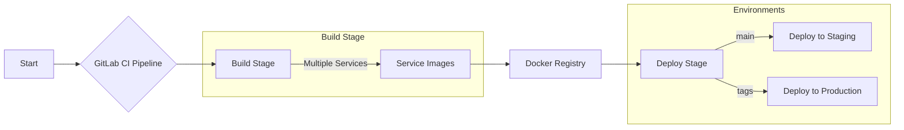

# Backend Monorepo CI/CD Pipeline

This document outlines the GitLab CI/CD pipeline for the Coldtivate backend monorepo - a Docker-based service collection. The pipeline's structure, technologies, and design rationale are covered to provide both technical details and clarity.

The pipeline aims to deliver:

* **Robust Docker Image Standardization:** Each service in the monorepo follows uniform build patterns, producing consistent and reliable Docker images for improved deployment predictability.
* **Fast, Safe Deployments:** Services get updated quickly with almost no downtime.
* **Environment Isolation:** Separate staging and production environments for stability.
* **Security First:** Safely handling SSH keys and secrets during deployments.

## A Step-by-Step Breakdown

The pipeline is structured into two main stages:

1.  **Build:** Creates Docker images for each monorepo service.
2.  **Deploy:** Pushes the Docker images to staging or production.

### Underlying Technologies and Tools

* **GitLab CI/CD:** Handles automated building and deploying.
* **Docker:** Containers for all backend services.
* **Docker BuildKit:** Speeds up Docker build processes with better efficiency.
* **SSH:** Securely deploys code to remote servers.
* **Git Submodules:** Include external repos directly in the monorepo.

### Key Pipeline Components

* **.build-docker-image Template:**
    * Central template for all Docker image builds.
    * Uses BuildKit for speed and GitLab registry login.
    * Sets up ssh-agent for submodule access.
    * Speeds up builds with `CACHE_IMAGE` for layer caching.
    * Tags images with branch slug and commit SHA for tracking.
    * Handles git submodules.
* **Build Jobs:**
    * Each service in the monorepo has a dedicated build job extending the `.build-docker-image` template.
    * Jobs like `build gateway image` and `build ml4-india image` exist for different services.
    * Jobs set custom variables (`CONTEXT_PATH`, `IMAGE_AND_TAGS`, etc.) to control their build behavior.
* **.deploy-to-environment Template:**
    * Template for standardized deployment steps.
    * Connects to servers via SSH.
    * Handles remote Docker login.
    * Runs deployment script on target server.
    * Works around GitLab CI limitations for env variables.
* **Deployment Jobs:**
    * Staging and production deployment jobs use the `.deploy-to-environment` template.
    * Each job sets variables like `ENVIRONMENT`, `HOST`, `USER`, `PRIVATE_KEY`, and `DOT_ENV`.

### Build Process Details

* **Docker BuildKit:** Uses Docker BuildKit for faster builds through better caching and parallel processing.
* **Caching:** Using `CACHE_IMAGE` for Docker layer caching - speeds up builds by reusing previous work.
* **Tagging:** Images get tagged with branch slug (`${CI_COMMIT_REF_SLUG}`) and short commit SHA (`${CI_COMMIT_SHORT_SHA}`) for clear version tracking.
* **Git Submodules:** Pipeline automatically handles fetching and updating any dependent repositories during builds.

### Deployment Process Details

* **SSH Deployment:** Uses SSH for secure server communication.
* **Environment Variables:** The `DOT_ENV` variable passes environment settings to the deployment script.
* **Deployment Script:** A bash script manages the actual deployment on remote servers.
* **Manual Deployments:** Deployments require explicit approval, giving teams control over release timing.

### Branching Strategy and Deployment Triggers

* **Main Branch:** Commits to `main` trigger builds and enable manual staging deployments.
* **Tags:** Tagged code triggers builds and enables manual production deployment.

### Environment Configuration

* **Staging:** Runs on dedicated staging server (`20.199.9.192`).
* **Production:** Runs on a dedicated production server (`20.74.81.183`).

## Key Considerations

* **SSH Key Management:** Keep SSH keys secure.
* **Environment Variable Security:** Keep secrets safe.
* **Script Maintenance:** Regularly update and test the `environment-deployment-management.sh` script.
* **Docker Registry Access:** Ensure that the GitLab CI/CD pipeline has proper access to the Docker registry.
* **Git Submodules:** Keep submodules updated and properly configured.
