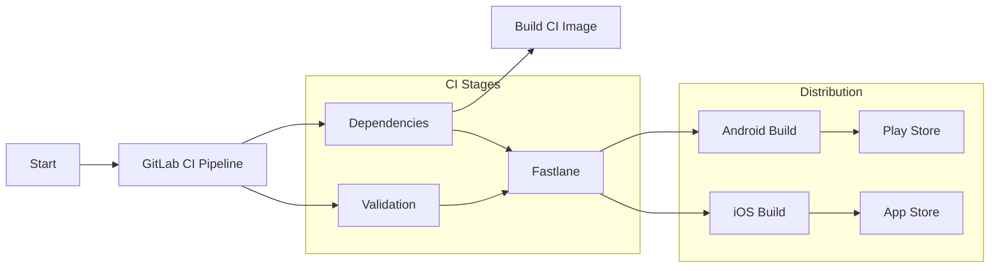

# Mobile App CI/CD Pipeline

Here's a breakdown of the Coldtivate app's GitLab CI/CD pipeline, the one used for building and deploying the React Native project.  It gets into the technical details, but also explains why things are set up the way they are.

The pipeline aims to deliver:

* **Efficiency:** Less manual work, more automation, faster development.
* **Consistency:** Making sure builds work the same way every time, no matter who's doing it or where.
* **Security:** Keeping code and releases safe from unauthorized access.
* **Transparency:** Clear pipelines anyone can understand and use.

## A Step-by-Step Breakdown

The pipeline follows code from development to users through three stages:

1.  **Dependencies: Laying the Foundation**

    * Sets up the build environment by installing all required dependencies.
    * Uses a custom Docker image (`${CI_REGISTRY_IMAGE}:ci`) that's updated when the `docker/ci` directory changes, ensuring consistent tools for everyone.
    * Handles JavaScript and Ruby dependencies with Yarn and Bundler.
    * Manages secrets with Git secret, using a GPG key for decryption.

2.  **Build: Crafting the Application**

    * This stage transforms code into deployable Android and iOS apps.
    * Android builds use Gradle and Fastlane for automation.
    * iOS builds rely on Xcode, CocoaPods, and Fastlane.
    * Fastlane picks the right `.env` file and generates build numbers.
    * Build caching speeds up the process.

3.  **Deploy: Reaching Our Users**

    * Final stage: deploying apps to Google Play Store and TestFlight.
    * Fastlane automates deployment for reliable releases.
    * Manual triggers allow controlled rollout when ready.

### Fastlane

Fastlane powers all the automation. It handles complex mobile build and deployment tasks while keeping things simple. The pipeline uses it to:

* Setting up environment configs with `setup_dotenv`.
* Creating build numbers using `generate_build_id` and `parse_version_id`.
* Pushing Android apps to Play Store via `upload_to_play_store`.
* Sending iOS builds to TestFlight with `upload_to_testflight`.

### Protecting Sensitive Information

Security is a top priority. Git Secret encrypts API keys and credentials, keeping them safe even if the repo gets compromised.

### Branching and Deployment

Branching and deployment follows a simple approach:

* Feature branches build the custom CI image for consistency.
* Tagged commits allow manual staging/production deployments.
* Manual deployment jobs ensure only vetted versions reach users.

### Environment Configuration

The pipeline maintains two distinct environments for stability:

* Staging: For testing with `.env.staging` configs.
* Production: Live environment using `.env.production`.

## Key Considerations

* **Secret Management:** Keep those GPG keys safe and make sure secrets are encrypted properly.
* **Fastlane Configuration:** Customize Fastlane lanes for the project's needs.
* **Caching:** Speed up builds with GitLab's cache features.
* **Release Control:** Manual triggers for major deployments keep things safe.
* **CI Image Maintenance:** Update the CI image regularly with newer dependencies and tools.
* **Code Signing:** Make sure iOS builds have proper code signing set up.
* **Google Service Account:** Keep the service account json file in the right spot.
