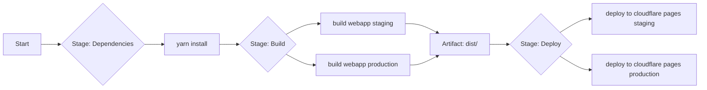

# Knowledge Hub CI/CD Pipeline

This document explains how Coldtivate's Knowledge Hub uses GitLab CI/CD for automated builds and deployments. It covers the pipeline setup, tech stack, and design decisions in plain terms.

The pipeline aims to deliver:

* **Automate dependency management:** Ensure consistent and reproducible builds.
* **Automate the build process:** Minimize manual intervention and reduce errors.
* **Facilitate rapid deployments:** Quickly deliver new features and fixes to our users.
* **Maintain separate environments:** Provide stable staging and production deployments.

## A Step-by-Step Breakdown

The pipeline is organized into distinct stages, each serving a specific purpose:

1.  **Dependencies:** Gets all needed packages first. Makes sure everything installs properly before moving to build.
2.  **Build:** Transpiles app code into deployment-ready output.
3.  **Deploy:** Pushes the built app to Cloudflare Pages for user access.

### Underlying Technologies

* **GitLab CI/CD:** The built-in automation tool that handles workflow tasks.
* **Docker:** Uses the lightweight `node:20-alpine` image for a consistent build environment that meets app requirements.
* **Yarn:** Package manager with caching for faster dependency installs.
* **Cloudflare Pages:** Fast, reliable hosting for static sites and SPAs.
* **Wrangler:** CLI tool for deploying to Cloudflare Pages.

### Key Pipeline Components

* **Template Scripts (.yarn-install):** A template script that handles dependency installation, configures Yarn's cache, and runs frozen installations for consistent builds, avoiding repetitive code.
* **Caching (.yarn-cache):** GitLab's caching stores Yarn's `node_modules` and `~/.yarn` folders, cutting build times significantly.
* **Build Jobs (build webapp staging, build webapp production):** Separate build jobs for staging and production environments using the `.build-webapp` template for shared build steps. Each environment gets configured with its own variables like `BASE_API_URL`.
* **Deployment Jobs:** Tasks that push the app to Cloudflare Pages using the `.publish-to-cloudflare` template and Wrangler. Staging and production each get their own deployment job with unique project names and branch settings.

### Branching Strategy and Deployment Triggers

* **Feature and Hotfix Branches:** New features and bug fixes are developed on dedicated branches (e.g., `feat/my-feature` or `hotfix/my-bugfix`), which trigger staging builds automatically.
* **Development and Main Branches:** Both `development` and `main` branches trigger staging deployments. `main` also supports manual production builds.
* **Tags:** Tagged commits initiate production deployments manually for controlled releases.

### Environment Configuration

* **Staging:** Testing ground at `knowledge-hub-staging.coldtivate.org` for new features and fixes. Connects to `api-staging.coldtivate.org`.
* **Production:** Live site at `knowledge-hub.coldtivate.org` for real users. Connects to `api.coldtivate.org`.

### Manual vs. Automatic Jobs

* Staging builds kick off automatically when code is pushed to certain branches.
* Production needs manual release by tagging - this keeps untested code away from users.

## Key Considerations

* **Variable Setup:** Double-check `PROJECT_NAME` and `BRANCH` variables in the cloudflare template for each environment.
* **Branching and Tagging:** Follow the team's branch/tag rules to keep deployments smooth and predictable.
* **Manual Job Execution:** Don't forget to hit the manual trigger for production deployments.
* **Security:** Keep sensitive data out of your CI/CD config. Use GitLab's secrets instead.
