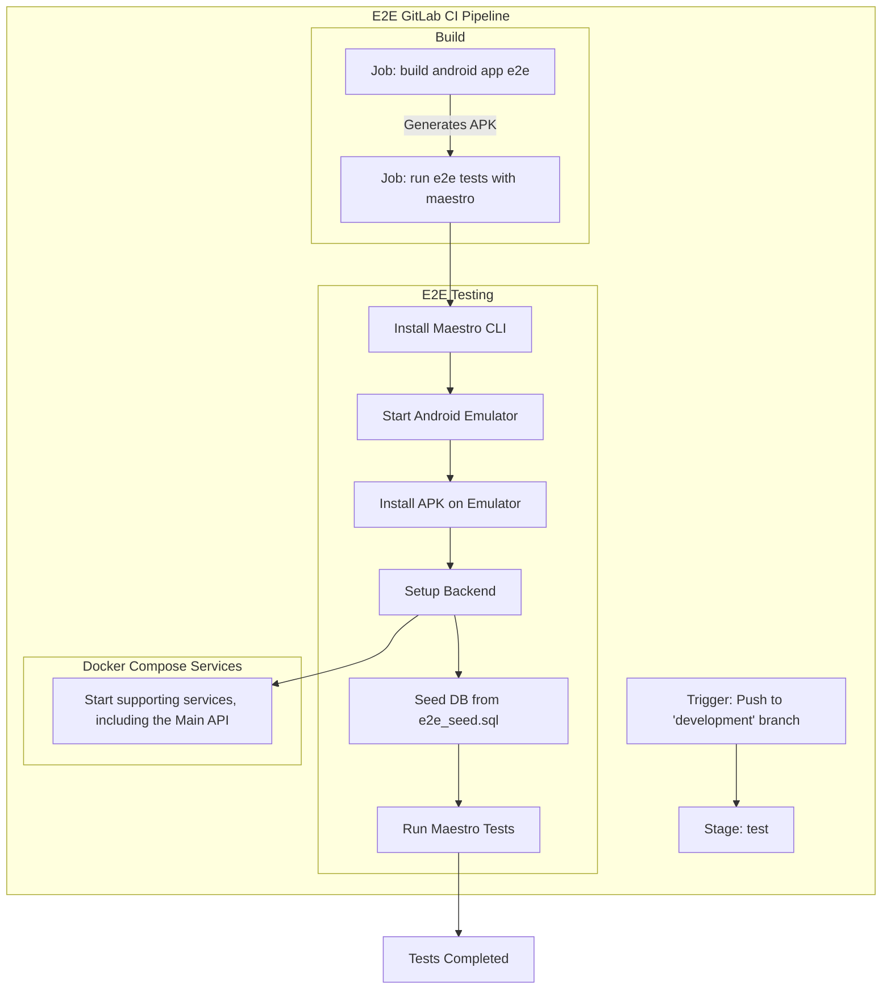

# QA Automation

This document outlines the End-to-End (E2E) GitLab CI pipeline for the Android application. The pipeline automates the process of building, testing, and validating the application's functionality, ensuring stability and reliability.

## Pipeline Trigger

The pipeline is initiated whenever changes are pushed to the `development` branch. This event sets off a sequence of stages designed to test the application efficiently.

## Build Stage

The first step in the pipeline is the build stage, where the Android application is prepared for testing. This involves generating an APK file that will be used in the next phase of testing.

## End-to-End Testing Stage

Once the build is complete, the pipeline proceeds to end-to-end testing using Maestro, a UI automation tool. The following steps take place:

1. **Setting Up the Environment**
    - The Maestro CLI is installed.
    - An Android emulator is started.
    - The APK is installed on the emulator.

2. **Backend Configuration**
    - Supporting backend services are started using Docker Compose.
    - The database is seeded with test data from `e2e_seed.sql`.

3. **Executing the Tests**
    - Maestro tests are run to validate the application's UI and functionality.

## Supporting Services

To ensure a fully functional testing environment, essential backend services, including the main API, are started using Docker Compose. These services provide the necessary infrastructure for running the tests seamlessly.

## Completion

Once all tests have been executed, the pipeline concludes with a status update marking the tests as completed. The results provide valuable insights into the application's performance, helping developers maintain high software quality.

By automating the build and testing process, this pipeline minimizes manual effort and ensures a consistent approach to validating the application's functionality before it progresses further in development.
